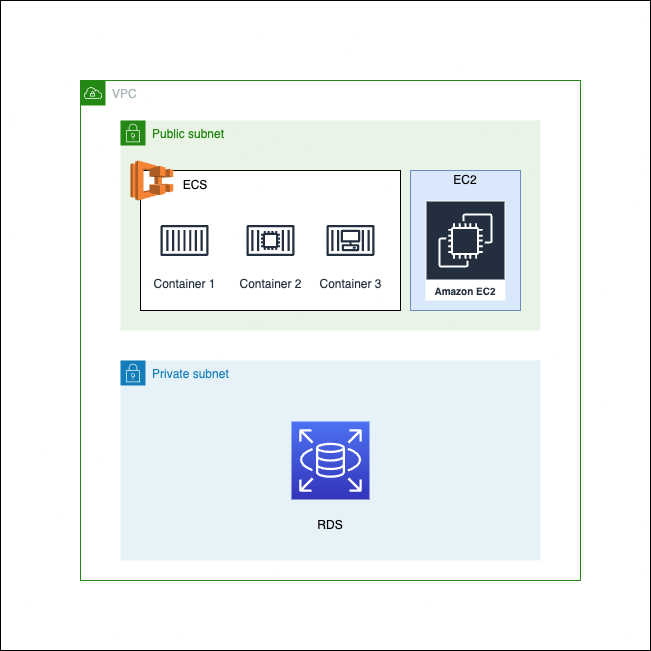

# Infrastructure as Code and Continuous Deployment Project with AWS, Terraform, Ansible, and GitHub Actions

## Description

This project provides a comprehensive solution for deploying and managing modern applications on AWS cloud. It leverages Terraform to automate the creation of resources such as EC2 for computing, RDS for databases, and ECS for container orchestration. Ansible is used for provisioning and detailed configuration of EC2 instances. Moreover, a Continuous Integration and Continuous Deployment (CI/CD) workflow is implemented using GitHub Actions. The combination of these elements creates a robust ecosystem for agile and efficient application delivery on AWS.

### Why EC2, ECS, and RDS?

- **EC2 (Elastic Compute Cloud)**: Used to demonstrate database connectivity capabilities, specifically to RDS. EC2 offers flexibility and complete control over our computing resources, making it the ideal choice for hosting our application. Additionally, Ansible is employed for Docker installation and image deployment on each EC2 instance, thereby establishing a secure connection with the RDS database.

- **ECS (Elastic Container Service)**: Utilized to demonstrate that the CI/CD workflow, built using GitHub Actions, functions as expected. ECS enables running applications in containers in a highly scalable and high-performance manner, which is particularly useful for applications with microservices architectures.

- **RDS (Relational Database Service)**: Provides relational databases that are easy to set up, operate, and scale. RDS is employed here as the data back-end for our application and is accessible from the EC2 instance.

These tools are not only robust but also highly compatible with each other, making integration seamless and efficient.



Of course, I can add the Ansible section to the Table of Contents. Here's the updated version:

## Table of Contents

- [Requirements](#requirements)
- [AWS Configuration](#aws-configuration)
- [GitHub Actions Configuration](#github-actions-configuration)
- [Terraform](#terraform)
- [Docker](#docker)
- [Ansible](#ansible)
- [Usage](#usage)
- [Contribute](#contribute)

## AWS Configuration

The project creates multiple resources on AWS, detailed in the following sections.

## GitHub Actions Configuration

The `.github/workflows/cicd.yml` file configures a GitHub Actions workflow for building and deployment.

## Terraform

Infrastructure as code is managed through Terraform files.

### Terraform Variables

Variables are defined in `variables.tf`.

### Terraform Outputs

Outputs are defined in `outputs.tf`.

## Docker

This project includes multiple Dockerfiles, each set up to create a Docker image serving a specific purpose. Each image is based on Ubuntu and comes pre-configured with a set of tools and services that facilitate the development and deployment of applications. The available Dockerfiles are:

- **apache.Dockerfile**: Sets up an environment with the Apache web server.
- **dotnet.Dockerfile**: Prepares an environment for .NET Core applications.
- **java.Dockerfile**: Establishes an environment for Java applications.
- **maven.Dockerfile**: Sets up a specific environment for Maven projects.

These various Docker images allow for great flexibility in deploying different types of applications, each with their own dependencies and configurations.

## Ansible

Ansible is employed for provisioning and configuring the EC2 instances on AWS. Ansible scripts enable Docker installation on each EC2 instance and the deployment of specific Docker images. This provides an efficient mechanism for server configuration, ensuring all instances have the necessary packages and settings.

#### What the Dockerfiles Do

This project includes various Dockerfiles, each configured for a specific purpose:

##### apache.Dockerfile
- **Uses Ubuntu as Base Image**: Ubuntu is the operating system on which all tools and services will be installed.
- **Installs and Configures Apache**: The Apache web server is installed and configured with a homepage displaying "Hello World Apache."
- **Exposes Port 80**: This port is exposed for the Apache web server.
- **Starts Apache**: Upon starting the container, the Apache web server is automatically started.

##### dotnet.Dockerfile
- **Uses Ubuntu as Base Image**: Ubuntu is the operating system on which all tools and services will be installed.
- **Installs .NET Core SDK**: The .NET Core SDK is installed to enable the compilation and running of .NET Core projects.
- **Exposes Port 80**: This port is exposed for the .NET application.
- **Starts the .NET Application**: Upon starting the container, the .NET application is automatically started.

##### java.Dockerfile
- **Uses Ubuntu as Base Image**: Ubuntu is the operating system on which all tools and services will be installed.
- **Installs Java and Maven**: The Java JRE and Maven are installed to enable the compilation and running of Java projects.
- **Exposes Port 80**: This port is exposed for the Java application.
- **Starts the Java Server**: Upon starting the container, the Java server is automatically started.

##### maven.Dockerfile
- **Uses Ubuntu as Base Image**: Ubuntu is the operating system on which all tools and services will be installed.
- **Installs Maven**: Maven is installed to enable the compilation and running of Maven projects.
- **Exposes Port 80**: This port is exposed for the Maven application.
- **Starts the Maven Server**: Upon starting the container, the Maven server is automatically started.

Each Dockerfile creates a specific, self-contained environment, allowing for greater flexibility and efficiency in the development and deployment of applications.

## Docker on ECS (Elastic Container Service)

The ECS in this project is configured to upload the Dockerfile located in the root directory, which serves as a complete development environment. This image is based on Ubuntu and comes pre-configured with a set of tools and services that facilitate application development and deployment.

#### What the Dockerfile in ECS Does:

1. **Uses Ubuntu as Base Image**: This is the operating system on which all tools and services will be installed.
   
2. **Installs Basic Utilities**: Includes tools like `wget`, `curl`, `gnupg`, and `lsb-release` to facilitate the downloading and installation of additional packages.
   
3. **Installs Git**: An essential tool for version control.

4. **Installs Visual Studio Code**: A widely used source code editor, which will be useful for development.

5. **Installs Maven**: A project management tool, especially useful for Java projects.

6. **Installs PostgreSQL and its Contributions**: An open-source relational database that will be used as a data storage system.

7. **Installs Java JRE**: The Java Runtime Environment, necessary for running Java applications.

8. **Installs .NET Core SDK**: The .NET Core SDK will enable the compilation and running of .NET Core projects.

9. **Installs Apache and Displays "Hello World"**: An Apache web server is installed and configured with a homepage displaying "Hello World."

10. **Exposes Ports 80 and 5432**: Port 80 is exposed for the Apache web server and port 5432 for PostgreSQL.

11. **Starts PostgreSQL and Apache**: Upon starting the container, both the Apache web server and the PostgreSQL database service are automatically started.

#### Results:

- The created Docker image will be mounted on the selected compute service.
- You can use Git for version control.
- You can edit code with Visual Studio Code.
- You can manage Java projects with Maven.
- You will have a ready-to-use PostgreSQL database.
- You can run Java applications thanks to the installed Java Runtime Environment.
- You can compile and run .NET Core projects.
- You will have a running Apache server with a homepage displaying "Hello World."

This Docker image is an end-to-end solution for developers, eliminating the need to manually install and configure multiple tools and services.

### Sample Projects in the Container

#### Java - Port 81

Within the `java_project` folder, there is a `Main.java` file that displays "Hello World Java" when accessed on the container's port 81.

#### Maven - Port 82

Within the `maven_project` folder, there is a basic Maven project that displays "Hello World Maven" when accessed on the container's port 82.

#### .NET - Port 83

Within the `net_project` folder, there is a .NET project that displays "Hello World .NET" when accessed on the container's port 83.

## Usage

### Step 0: Clone the Repository

Clone this repository onto your local machine.

```bash
git clone https://github.com/alexandropinna/aws_test.git
```

### Step 1: Configure Terraform Variables

Before deploying the infrastructure with Terraform, you need to configure certain variables specific to your environment. In this repository, you'll find a `tfvars.example` file that contains an example of the variables you need to configure.

#### How to Use tfvars.example?

1. **Rename the File**: Copy the `tfvars.example` file and rename it to `terraform.tfvars`.

    ```bash
    cp tfvars.example terraform.tfvars
    ```

2. **Edit Variables**: Open `terraform.tfvars` with a text editor and modify the variables as per your needs. For example, replace the values for CIDR, subnets, and so on, according to your AWS configuration.

    ```bash
    virginia_cidr = "your_cidr_value_here"
    subnets = ["your_subnet_value_1_here", "your_subnet_value_2_here"]
    ```

    And so on for all the variables listed in `terraform.tfvars`.

3. **Save and Close**: Once you have finished editing the variables, save and close the file.

With these steps, your `terraform.tfvars` file will be ready to be used by Terraform for deploying the infrastructure.

### Step 2: Configure AWS Credentials

Make sure your AWS credentials are correctly configured.

### Step 3: Initialize and Apply Terraform

Initialize Terraform and apply the configuration.

```bash
terraform init
terraform apply
```

### Step 4: Install Docker Using Ansible

After creating the infrastructure with Terraform, a `maquinas.ini` file will be generated. This file contains the names of the virtual machines on AWS. Additionally, a folder called `host_vars` will be created, containing individual YAML files for each virtual machine. These YAML files will have details like the IP address, the location of the public key, and the user that will be used to log into each virtual machine.

1. **Install Docker on Virtual Machines**: Run the following command to install Docker on all the virtual machines specified in `maquinas.ini`.

    ```bash
    ansible-playbook install_docker.yml
    ```

2. **Upload Docker Images to Virtual Machines**: Run the following command to upload the Docker images to each EC2 virtual machine.

    ```bash
    ansible-playbook upload_docker_images.yml
    ```

With these steps, you'll have Docker installed on all virtual machines, and the necessary Docker images will be uploaded to each EC2 instance.

### Step 5: Trigger GitHub Actions

Make a push to the repository to trigger the GitHub Actions workflow.

```bash
git add .
git commit -m "Commit message"
git push origin main
```

## Author

- Alejandro Piña ([email](mailto:alexander.pinna@protonmail.com))